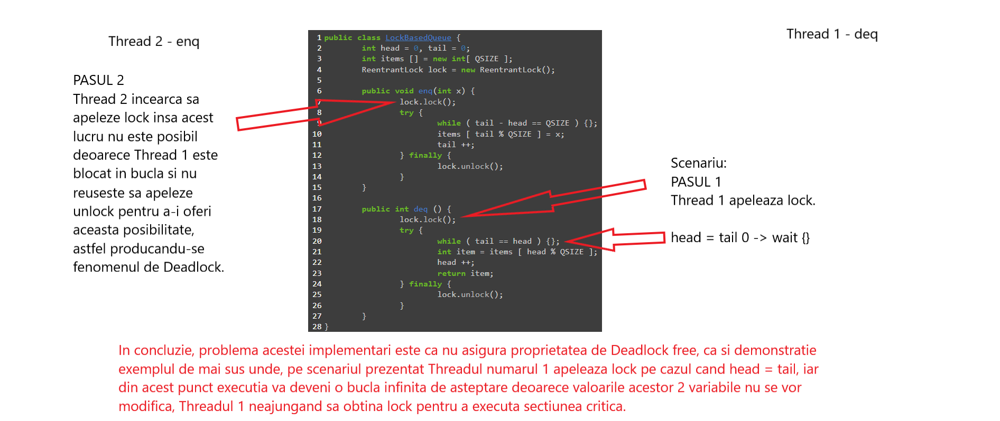

# Exercitiul 4
 
a)Explicatie Single Lock:

b)Explicatie Double Lock:
Test Experimental: aici si in poza 'Statistici'
Double lock queue:
DoubleLockBased{head=20, tail=20, items=[1, 2, 7, 3, 8, 5, 2, 9, 7, 6]
, allItems=    [3, 5, 8, 8, 7, 8, 6, 8, 1, 3, 1, 2, 7, 3, 8, 5, 2, 9, 7, 6]
, dequed Items=[3, 5, 8, 8, 7, 8, 6, 8, 1, 3, 1, 2, 7, 3, 8, 5, 2, 9, 7, 6]
Algoritmul prezentat la subpunctul b) ce se bazeaza pe 2 lacate de tip ReentrantLock in implementare este corect. 
Faptul ca foloseste 2 lacate, unul pentru enq si altul pentru deq se evita producerea fenomenului de DeadLock (cum se intampla la punctul a).
Alte probleme ar putea aparea in momentul in care au loc mai multe operatii de deq decat cele enq dar acest fenomen e prevenit
de conditia: ' while ( tail == head ) {}' unde se asteapta in cazul in care head ajunge din urma tail, totodata avand garantia ca intotdeauna operatia 
de enq se va face inaintea celei de deq la primul pas 
Un alt caz problematic ar fi atunci cand tail depaseste QSIZE si va seprascrie valorile, iar head are inca o valoare mica, de exemplu 0 
si nu apuca sa faca operatiile potrivite de eq deoarece valorile din coada vor fi inlocuite dar si aceasta ordine este garantata de conditia urmatoare din 
enq: "while ( tail - head == QSIZE ) {};" unde se asteapta citire si headul creste daca tailul atinge capacitatea cozii