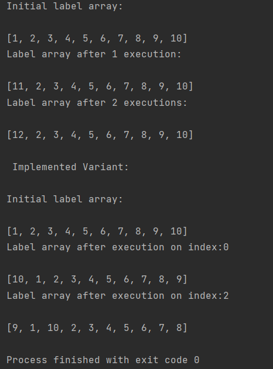

# Exercițiul 5

**a.** Pentru a demonstra că algoritmul propus asigură **excludere mutuală**, trebuie să arătăm că un singur proces sau thread are permisiunea de a accesa resursa partajată la un moment dat.

Astfel, vedem că în funcția `lock()`, pentru a primi acces la secțiunea critică, un thread este blocat de condiția `await ( every j != i has ( flag[j] == false || label[j] > label[i] )) {};`. Practic, thread-ul așteaptă până când niciun thread nu mai are flag-ul setat, sau o etichetă mai mare. Astfel, asigurăm că thread-ul curent nu intră în secțiunea critică dacă mai sunt altele în ea.

Prezentăm următorul scenariu:
1.  Începe execuția programului.
2.  T1 setează `flag[1]` la true pentru a semnala dorința de a intra în secțiunea critică.
3.  T1 ajunge la condiția `flag[j] == false || label[j] > label[1]`. Ea este îndeplinită pentru toate celelalte thread-uri (j ≠ 1), fiind primul care încearcă să acceseze secțiunea critică.
4.  T1 verifică dacă orice alt thread are încă acces (`access[j] == true`). Nu este cazul, fiind primul.
5.  Acum, T2 setează `flag[2]` la `true` pentru a semnala dorința de a intra în secțiunea critică.
6.  T2 trebuie acum să aștepte până când condiția `flag[j] == false || label[j] > label[2]` este îndeplinită, implicit până când T1 cedează locul la secțiunea critică. Raționamentul este similar pentru alte thread-uri care ar cere acum acces la secțiune.
7.  Se observă că un singur thread are acces, demonstrând proprietatea de excludere mutuală a algoritmului.

***

**b.** Pentru demonstrarea existenței proprietății **deadlock-free** a algoritmului, ne uităm la aspectele acestei proprietăți:
1.  Fiecare thread așteaptă eliberarea resurselor deținute de celălalt, dar fără să țină ocupată o altă resursă la care ar aștepta un alt thread.
2.  Dacă un thread are acces la secțiunea critică, acest acces nu îi poate fi preluat de un alt thread, astfel că unui thread i se va permite la un moment dat accesul și posibilitatea aplicării operațiilor dorite asupra secțiunii critice -- el nu rămâne blocat.

Pentru demonstrarea existenței proprietății **starvation-free** a algoritmului, vom analiza din nou aspectele proprietății:
1.  Datorită creșterii constante a etichetelor (fiecare are o etichetă distinctă) la fiecare intrare în regiunea critică, un thread care așteaptă va primi la un moment dat o etichetă mai mare, care îi va permite accesul.
2.  Accesul la secțiunea critică nu le este preluat, astfel că printr-un raționament similar explicat la deadlock-free, thread-urile nu vor suferi de starvation și vor putea accesa secțiunea într-un timp finit.

***

**c.**  Pe lângă implementarea atașată, prezentăm și output-ul pseudocodului implementat de noi, de unde se poate înțelege funcționalitatea abordării noastre.

