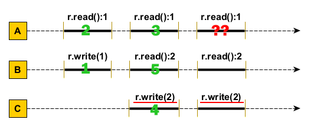
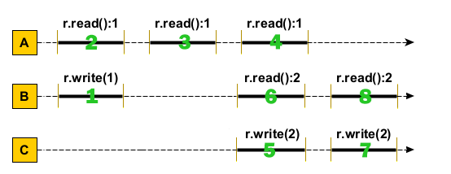

# Exercițiul 1

Secvența **nu este linearizabilă**. În al doilea pas (pe axa real-time), thread-ul `C` va executa un apel `r.write(2)`, fiind si singurul apel `write` din acest pas. În al treilea pas (pe axa real-time) avem tot un singur apel `write`, care scrie tot valoarea `2`. Observăm că în acest pas thread-ul `A` ar dori să citească valoarea `1`, lucru imposibil deoarece variabila `r` are obligatoriu valoarea `2` setată în pasul anterior și nemodificată în pasul curent.

Am ilustrat această demonstrație și pe reprezentarea grafică a istoriei de execuție:

Cu toate acestea, putem afirma că secvența **este consistent secvențială**. Singura diferență ar apărea la thread-ul `A`, unde am dori ca toate cele 3 apeluri `r.read():1` să se întâmple înseriat, înainte de apelurile `r.write(2)` ale thread-ului `C`.

